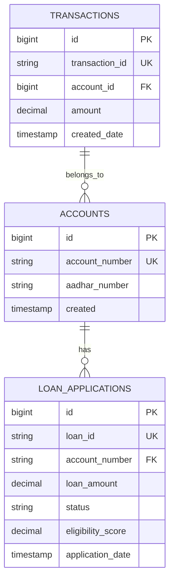

# Design Document: Loan Management System

## Overview

The Loan Management System is a comprehensive feature that extends the existing banking simulator with loan application, automated credit scoring, and administrative management capabilities. The system processes loan applications through a sophisticated 12-factor credit scoring algorithm, automatically determines eligibility, assigns interest rates, calculates EMI, and notifies customers via email.

### Key Capabilities

- **Customer Loan Application**: Multi-step form for submitting loan requests with financial and personal details
- **Automated Credit Scoring**: 12-factor algorithm evaluating income, employment, DTI ratio, repayment history, age, existing loans, collateral, banking relationship, residence stability, loan purpose, guarantor, and transaction patterns
- **Intelligent Decision Engine**: Automatic approval, rejection, or flagging for manual review based on eligibility score and DTI ratio
- **Interest Rate Assignment**: Risk-based pricing from 7.5% to 12.0% based on creditworthiness
- **EMI Calculation**: Standard loan amortization formula for monthly payment computation
- **Email Notifications**: Automated status updates sent to customers
- **Customer Dashboard**: Visual representation of credit score, factor breakdown, loan history, and improvement tips
- **Admin Management**: Comprehensive loan portfolio management with statistics and manual status override

### Design Principles

1. **Non-Breaking Integration**: All new code is additive; no modifications to existing entities, services, or controllers
2. **Separation of Concerns**: Clear boundaries between loan application, credit scoring, decision logic, and notification
3. **Transparency**: Individual factor scores and improvement tips provide explainability
4. **Extensibility**: Modular design allows easy addition of new scoring factors or decision rules
5. **Security**: JWT authentication with role-based access control for customer and admin endpoints

## Architecture

### High-Level Architecture

```mermaid
graph TB
    subgraph Frontend
        LoanForm[Loan Application Form]
        LoanDashboard[Loan Dashboard]
        AdminPanel[Admin Loan Management]
    end
    
    subgraph Backend
        LoanController[Loan Controller]
        LoanService[Loan Service]
        CreditScorer[Credit Scoring Service]
        NotificationSvc[Notification Service]
        
        LoanRepo[Loan Repository]
        AccountRepo[Account Repository]
        TransactionRepo[Transaction Repository]
    end
    
    subgraph Database
        LoanTable[(loan_applications)]
        AccountTable[(accounts)]
        TransactionTable[(transactions)]
    end
    
    LoanForm -->|POST /loan/apply| LoanController
    LoanDashboard -->|GET /loan/account/{accountNumber}| LoanController
    AdminPanel -->|GET /loan/all| LoanController
    AdminPanel -->|PUT /loan/{loanId}/status| LoanController
    
    LoanController --> LoanService
    LoanService --> CreditScorer
    LoanService --> NotificationSvc
    LoanService --> LoanRepo
    CreditScorer --> AccountRepo
    CreditScorer --> TransactionRepo
    
    LoanRepo --> LoanTable
    AccountRepo --> AccountTable
    TransactionRepo --> TransactionTable
```

### Component Interaction Flow

**Loan Application Flow:**
1. Customer submits loan application via frontend form
2. LoanController validates request and delegates to LoanService
3. LoanService invokes CreditScoringService to calculate eligibility score
4. CreditScoringService retrieves account and transaction data from existing repositories
5. CreditScoringService calculates 12 factor scores and aggregates to eligibility score
6. LoanService applies decision logic (APPROVED/REJECTED/UNDER_REVIEW)
7. LoanService assigns interest rate based on eligibility score
8. LoanService calculates EMI for approved loans
9. LoanService generates improvement tips for weak factors
10. LoanService persists loan application to database
11. LoanService sends email notification via NotificationService
12. LoanController returns loan response to frontend

**Admin Management Flow:**
1. Admin views loan statistics and list via AdminPanel
2. Admin updates loan status via PUT endpoint
3. LoanService updates database and sends notification
4. Frontend refreshes to show updated status

### Technology Stack

- **Backend**: Spring Boot 3.x, Java 17+
- **Frontend**: React 18+, TypeScript, Recharts for visualizations
- **Database**: JPA/Hibernate with existing database (MySQL/PostgreSQL)
- **Security**: JWT authentication, Spring Security
- **Email**: Existing NotificationService implementation

## Components and Interfaces

### Backend Components

#### 1. LoanEntity

**Purpose**: JPA entity representing a loan application with all scoring factors and results

**Key Fields**:
- `loanId` (String): Unique identifier in format LOAN-XXXXXXXX
- `accountNumber` (String): Links to customer's account
- `loanAmount` (BigDecimal): Requested loan amount (10,000 - 10,000,000 INR)
- `loanPurpose` (String): EDUCATION, HOME, BUSINESS, PERSONAL, VEHICLE
- `loanTenure` (Integer): Loan duration in months (6-360)
- `monthlyIncome` (BigDecimal): Applicant's monthly income
- `employmentType` (String): SALARIED, SELF_EMPLOYED, GOVERNMENT, UNEMPLOYED
- `existingEmi` (BigDecimal): Total monthly EMI on existing loans
- `creditScore` (Integer): Credit bureau score (300-900)
- `age` (Integer): Applicant age (18-70)
- `existingLoans` (Integer): Count of existing loans
- `hasCollateral` (Boolean): Collateral availability
- `residenceYears` (Integer): Years at current residence
- `hasGuarantor` (Boolean): Guarantor availability
- `repaymentHistory` (String): CLEAN or NOT_CLEAN
- Factor scores (12 fields): Individual scores for each factor
- `eligibilityScore` (BigDecimal): Aggregated score (0-100)
- `dtiRatio` (BigDecimal): Debt-to-income ratio
- `status` (String): PENDING, APPROVED, REJECTED, UNDER_REVIEW
- `interestRate` (BigDecimal): Assigned interest rate percentage
- `emi` (BigDecimal): Calculated monthly payment
- `rejectionReason` (String): Explanation for rejection
- `improvementTips` (List<String>): Actionable advice for improvement
- `applicationDate` (LocalDateTime): Submission timestamp
- `lastUpdated` (LocalDateTime): Last modification timestamp

**Annotations**: `@Entity`, `@Table(name = "loan_applications")`, `@Id`, `@GeneratedValue`, `@Column`, `@CreationTimestamp`, `@UpdateTimestamp`

#### 2. LoanRepository

**Purpose**: Spring Data JPA repository for loan persistence

**Methods**:
- `List<LoanEntity> findByAccountNumberOrderByApplicationDateDesc(String accountNumber)`: Retrieve customer's loans
- `Optional<LoanEntity> findByLoanId(String loanId)`: Find loan by ID
- `List<LoanEntity> findAllByOrderByApplicationDateDesc()`: Retrieve all loans for admin
- `Long countByStatus(String status)`: Count loans by status
- `BigDecimal sumLoanAmountByStatus(String status)`: Sum approved loan amounts
- `Double avgEligibilityScore()`: Calculate average eligibility score

**Interface**: Extends `JpaRepository<LoanEntity, Long>`

#### 3. CreditScoringService

**Purpose**: Implements the 12-factor credit scoring algorithm

**Methods**:

```java
CreditScoreResult calculateCreditScore(LoanApplicationRequest request, String accountNumber)
```

**Internal Methods**:
- `double calculateIncomeScore(BigDecimal monthlyIncome)`: Max 120 points
- `double calculateEmploymentScore(String employmentType)`: Max 80 points
- `double calculateDtiScore(BigDecimal dtiRatio)`: Max 100 points
- `double calculateRepaymentHistoryScore(String repaymentHistory)`: Max 100 points
- `double calculateAgeScore(int age)`: Max 60 points
- `double calculateExistingLoansScore(int existingLoans)`: Max 60 points
- `double calculateCollateralScore(boolean hasCollateral)`: Max 70 points
- `double calculateBankingRelationshipScore(String accountNumber)`: Max 50 points
- `double calculateResidenceScore(int residenceYears)`: Max 40 points
- `double calculateLoanPurposeScore(String loanPurpose)`: Max 40 points
- `double calculateGuarantorScore(boolean hasGuarantor)`: Max 30 points
- `double calculateTransactionPatternScore(String accountNumber)`: Informational (not scored)
- `BigDecimal calculateDtiRatio(BigDecimal existingEmi, BigDecimal monthlyIncome)`: DTI calculation

**Dependencies**: AccountRepository, TransactionRepository

**Return Type**: `CreditScoreResult` containing all factor scores, eligibility score, and DTI ratio

#### 4. LoanService

**Purpose**: Orchestrates loan application processing, decision logic, and management

**Methods**:

```java
LoanResponse applyForLoan(LoanApplicationRequest request, String accountNumber)
List<LoanResponse> getLoansByAccount(String accountNumber)
LoanResponse getLoanById(String loanId)
List<LoanResponse> getAllLoans()
void updateLoanStatus(String loanId, String newStatus)
LoanStatistics getLoanStatistics()
```

**Internal Methods**:
- `String generateLoanId()`: Generate unique LOAN-XXXXXXXX identifier
- `String determineStatus(double eligibilityScore, BigDecimal dtiRatio)`: Apply decision rules
- `BigDecimal assignInterestRate(double eligibilityScore, String status)`: Risk-based pricing
- `BigDecimal calculateEmi(BigDecimal loanAmount, BigDecimal interestRate, int tenure)`: EMI formula
- `String generateRejectionReason(CreditScoreResult scoreResult)`: Identify weak factors
- `List<String> generateImprovementTips(CreditScoreResult scoreResult, String status)`: Actionable advice

**Dependencies**: CreditScoringService, LoanRepository, NotificationService

#### 5. LoanController

**Purpose**: REST API endpoints for loan operations

**Endpoints**:

```java
POST   /loan/apply                          // Apply for loan (authenticated)
GET    /loan/account/{accountNumber}        // Get customer's loans (authenticated)
GET    /loan/{loanId}                       // Get loan by ID (authenticated)
GET    /loan/all                            // Get all loans (admin only)
PUT    /loan/{loanId}/status                // Update loan status (admin only)
GET    /loan/statistics                     // Get loan statistics (admin only)
```

**Security**: All endpoints require JWT authentication; admin endpoints require ADMIN role

**Request/Response**: Uses DTOs for clean API contracts

### Frontend Components

#### 1. LoanApplicationForm

**Purpose**: Multi-step form for loan application submission

**Steps**:
1. **Personal Information**: Age, employment type, residence years, guarantor
2. **Financial Information**: Monthly income, existing EMI, credit score, existing loans, collateral
3. **Loan Details**: Loan amount, purpose, tenure

**Features**:
- Field validation with inline error messages
- Progress indicator showing current step
- Navigation between steps
- Form submission with loading state
- Results display with eligibility score, status, interest rate, EMI, and improvement tips

**State Management**: React hooks for form state and validation

#### 2. LoanDashboard

**Purpose**: Customer view of loan eligibility and history

**Sections**:
- **Top Metrics Cards**: Credit Score, Max Loan Eligibility, DTI Ratio, Active Loans
- **Credit Score Gauge**: Recharts gauge chart (300-900 range)
- **Factor Scores Bar Chart**: Horizontal bar chart showing 12 factor scores
- **Factor Information Grid**: 3x4 grid of cards with factor name, score, max score, and progress bar
- **Improvement Tips**: Alert box with actionable advice (shown when status is REJECTED or UNDER_REVIEW)
- **Loan History Table**: All loan applications with status, amount, interest rate, EMI, application date

**Data Fetching**: API calls to `/loan/account/{accountNumber}` on component mount

#### 3. AdminLoanManagement

**Purpose**: Admin interface for loan portfolio management

**Sections**:
- **Statistics Cards**: Total Applications, Approved Count, Rejected Count, Under Review Count, Total Approved Amount, Average Eligibility Score
- **Loan Management Table**: All loans with columns for Loan ID, Account Number, Amount, Status, Eligibility Score, Interest Rate, Application Date, Actions
- **Status Update**: Dropdown in each row to change status with immediate API call
- **Analytics Charts**: 
  - Loan Purpose Distribution (pie chart)
  - Loan Status by Month (line chart)

**Data Fetching**: API calls to `/loan/all` and `/loan/statistics` on component mount

### DTOs (Data Transfer Objects)

#### LoanApplicationRequest

```java
{
  loanAmount: BigDecimal,
  loanPurpose: String,
  loanTenure: Integer,
  monthlyIncome: BigDecimal,
  employmentType: String,
  existingEmi: BigDecimal,
  creditScore: Integer,
  age: Integer,
  existingLoans: Integer,
  hasCollateral: Boolean,
  residenceYears: Integer,
  hasGuarantor: Boolean,
  repaymentHistory: String
}
```

#### LoanResponse

```java
{
  loanId: String,
  accountNumber: String,
  loanAmount: BigDecimal,
  loanPurpose: String,
  loanTenure: Integer,
  eligibilityScore: BigDecimal,
  dtiRatio: BigDecimal,
  status: String,
  interestRate: BigDecimal,
  emi: BigDecimal,
  rejectionReason: String,
  improvementTips: List<String>,
  applicationDate: LocalDateTime,
  lastUpdated: LocalDateTime,
  factorScores: {
    incomeScore: Double,
    employmentScore: Double,
    dtiScore: Double,
    repaymentHistoryScore: Double,
    ageScore: Double,
    existingLoansScore: Double,
    collateralScore: Double,
    bankingRelationshipScore: Double,
    residenceScore: Double,
    loanPurposeScore: Double,
    guarantorScore: Double
  }
}
```

#### LoanStatistics

```java
{
  totalApplications: Long,
  approvedCount: Long,
  rejectedCount: Long,
  underReviewCount: Long,
  pendingCount: Long,
  totalApprovedAmount: BigDecimal,
  averageEligibilityScore: Double
}
```

#### UpdateLoanStatusRequest

```java
{
  status: String
}
```

## Data Models

### Database Schema

#### loan_applications Table

| Column Name | Type | Constraints | Description |
|------------|------|-------------|-------------|
| id | BIGINT | PRIMARY KEY, AUTO_INCREMENT | Internal ID |
| loan_id | VARCHAR(20) | UNIQUE, NOT NULL | LOAN-XXXXXXXX format |
| account_number | VARCHAR(30) | NOT NULL, FK to accounts | Customer account |
| loan_amount | DECIMAL(15,2) | NOT NULL | Requested amount |
| loan_purpose | VARCHAR(20) | NOT NULL | EDUCATION/HOME/BUSINESS/PERSONAL/VEHICLE |
| loan_tenure | INT | NOT NULL | Months (6-360) |
| monthly_income | DECIMAL(15,2) | NOT NULL | Applicant income |
| employment_type | VARCHAR(20) | NOT NULL | SALARIED/SELF_EMPLOYED/GOVERNMENT/UNEMPLOYED |
| existing_emi | DECIMAL(15,2) | NOT NULL | Total monthly EMI |
| credit_score | INT | NOT NULL | 300-900 |
| age | INT | NOT NULL | 18-70 |
| existing_loans | INT | NOT NULL | Count of loans |
| has_collateral | BOOLEAN | NOT NULL | Collateral flag |
| residence_years | INT | NOT NULL | Years at residence |
| has_guarantor | BOOLEAN | NOT NULL | Guarantor flag |
| repayment_history | VARCHAR(20) | NOT NULL | CLEAN/NOT_CLEAN |
| income_score | DOUBLE | NOT NULL | Factor score |
| employment_score | DOUBLE | NOT NULL | Factor score |
| dti_score | DOUBLE | NOT NULL | Factor score |
| repayment_history_score | DOUBLE | NOT NULL | Factor score |
| age_score | DOUBLE | NOT NULL | Factor score |
| existing_loans_score | DOUBLE | NOT NULL | Factor score |
| collateral_score | DOUBLE | NOT NULL | Factor score |
| banking_relationship_score | DOUBLE | NOT NULL | Factor score |
| residence_score | DOUBLE | NOT NULL | Factor score |
| loan_purpose_score | DOUBLE | NOT NULL | Factor score |
| guarantor_score | DOUBLE | NOT NULL | Factor score |
| eligibility_score | DECIMAL(5,2) | NOT NULL | 0-100 |
| dti_ratio | DECIMAL(5,4) | NOT NULL | Debt-to-income |
| status | VARCHAR(20) | NOT NULL | PENDING/APPROVED/REJECTED/UNDER_REVIEW |
| interest_rate | DECIMAL(5,2) | NOT NULL | Annual percentage |
| emi | DECIMAL(15,2) | NULL | Monthly payment |
| rejection_reason | TEXT | NULL | Rejection explanation |
| improvement_tips | TEXT | NULL | JSON array of tips |
| application_date | TIMESTAMP | NOT NULL | Submission time |
| last_updated | TIMESTAMP | NOT NULL | Last modification |

**Indexes**:
- PRIMARY KEY on `id`
- UNIQUE INDEX on `loan_id`
- INDEX on `account_number` for customer queries
- INDEX on `status` for admin filtering
- INDEX on `application_date` for sorting

**Relationships**:
- Foreign key to `accounts.account_number` (no cascade, informational only)

### Entity Relationships



### Credit Scoring Algorithm Details

#### Factor Weights and Scoring Rules

**1. Income Score (Max: 120 points)**
```
>= 100,000 INR  → 120 points
75,000-99,999   → 100 points
50,000-74,999   → 80 points
30,000-49,999   → 60 points
20,000-29,999   → 40 points
< 20,000        → 20 points
```

**2. Employment Score (Max: 80 points)**
```
GOVERNMENT      → 80 points
SALARIED        → 70 points
SELF_EMPLOYED   → 50 points
UNEMPLOYED      → 0 points
```

**3. DTI Score (Max: 100 points)**
```
DTI = existing_emi / monthly_income

< 0.20          → 100 points
0.20-0.29       → 80 points
0.30-0.39       → 60 points
0.40-0.49       → 40 points
>= 0.50         → 0 points
```

**4. Repayment History Score (Max: 100 points)**
```
CLEAN           → 100 points
NOT_CLEAN       → 0 points
```

**5. Age Score (Max: 60 points)**
```
30-50 years     → 60 points
25-29 or 51-60  → 50 points
18-24 or 61-70  → 30 points
```

**6. Existing Loans Score (Max: 60 points)**
```
0 loans         → 60 points
1 loan          → 50 points
2 loans         → 30 points
>= 3 loans      → 0 points
```

**7. Collateral Score (Max: 70 points)**
```
Has collateral  → 70 points
No collateral   → 0 points
```

**8. Banking Relationship Score (Max: 50 points)**
```
Months = months_since(account.created)

>= 24 months    → 50 points
12-23 months    → 40 points
6-11 months     → 25 points
< 6 months      → 10 points
```

**9. Residence Score (Max: 40 points)**
```
>= 5 years      → 40 points
3-4 years       → 30 points
1-2 years       → 20 points
< 1 year        → 10 points
```

**10. Loan Purpose Score (Max: 40 points)**
```
EDUCATION/HOME  → 40 points
BUSINESS        → 30 points
VEHICLE         → 25 points
PERSONAL        → 15 points
```

**11. Guarantor Score (Max: 30 points)**
```
Has guarantor   → 30 points
No guarantor    → 0 points
```

**12. Transaction Pattern (Informational)**
- Retrieve last 6 months of transactions
- Calculate transaction volume
- Display in frontend chart
- Not included in eligibility score calculation

**Total Maximum Score**: 750 points

**Eligibility Score Calculation**:
```
eligibility_score = (sum_of_all_factor_scores / 750) * 100
```

Result: 0-100 scale

#### Decision Logic

```
IF eligibility_score >= 750 AND dti_ratio < 0.40:
    status = APPROVED
ELSE IF eligibility_score >= 650 AND eligibility_score < 750:
    status = UNDER_REVIEW
ELSE IF dti_ratio >= 0.40 AND dti_ratio <= 0.50:
    status = UNDER_REVIEW
ELSE IF eligibility_score < 650 OR dti_ratio > 0.50:
    status = REJECTED
```

#### Interest Rate Assignment

```
IF status == REJECTED:
    interest_rate = 0.0%
ELSE IF eligibility_score >= 800:
    interest_rate = 7.5%
ELSE IF eligibility_score >= 750:
    interest_rate = 8.5%
ELSE IF eligibility_score >= 700:
    interest_rate = 10.0%
ELSE IF eligibility_score >= 650:
    interest_rate = 12.0%
```

#### EMI Calculation

```
P = loan_amount
r = (interest_rate / 12) / 100  // monthly rate
n = loan_tenure  // months

EMI = P * r * (1 + r)^n / ((1 + r)^n - 1)
```

Round to 2 decimal places.

#### Improvement Tips Generation

For each factor where `factor_score < (max_factor_score * 0.5)`:

- **Income**: "Increase your monthly income to improve eligibility. Consider additional income sources."
- **Employment**: "Stable employment (salaried or government) improves your score significantly."
- **DTI**: "Reduce existing EMI obligations to lower your debt-to-income ratio."
- **Repayment History**: "Maintain a clean repayment history by paying all dues on time."
- **Age**: "Your age group affects eligibility. Optimal age range is 30-50 years."
- **Existing Loans**: "Reduce the number of existing loans before applying."
- **Collateral**: "Providing collateral can significantly improve your loan eligibility."
- **Banking Relationship**: "Build a longer banking relationship by maintaining your account."
- **Residence**: "Longer residence at current address indicates stability."
- **Loan Purpose**: "Education and home loans receive higher scores due to lower risk."
- **Guarantor**: "Having a guarantor can improve your loan eligibility."


## Correctness Properties

*A property is a characteristic or behavior that should hold true across all valid executions of a system—essentially, a formal statement about what the system should do. Properties serve as the bridge between human-readable specifications and machine-verifiable correctness guarantees.*

### Property Reflection

After analyzing all 30 requirements with 100+ acceptance criteria, I identified the following testable properties. Many individual scoring rules (Requirements 3-13) can be consolidated into comprehensive properties that verify the entire scoring algorithm rather than testing each bracket individually.

**Consolidated Properties:**
- Individual factor scoring rules (3.1-3.6, 4.1-4.4, 5.2-5.6, etc.) are consolidated into single properties per factor
- Decision logic rules (14.1-14.3) are consolidated into one comprehensive decision property
- Interest rate rules (15.1-15.5) are consolidated into one comprehensive rate assignment property

**Excluded from Properties:**
- Integration tests (database queries, repository calls, notification service)
- UI rendering and interaction tests
- Infrastructure tests (JPA configuration, Spring Security)
- Manual verification tests (code review for non-breaking changes)

### Property 1: Loan ID Format and Uniqueness

*For any* set of loan applications, all generated loan IDs SHALL match the pattern "LOAN-[0-9]{8}" and SHALL be unique across all applications.

**Validates: Requirements 1.2**

### Property 2: Input Validation Completeness

*For any* loan application with one or more missing required fields, the validation SHALL reject the application and identify all missing fields.

**Validates: Requirements 1.1**

### Property 3: Income Score Calculation

*For any* monthly income value, the calculated income score SHALL match the specified bracket rules:
- income >= 100000 → 120 points
- 75000 <= income < 100000 → 100 points
- 50000 <= income < 75000 → 80 points
- 30000 <= income < 50000 → 60 points
- 20000 <= income < 30000 → 40 points
- income < 20000 → 20 points

**Validates: Requirements 3.1, 3.2, 3.3, 3.4, 3.5, 3.6**

### Property 4: Employment Score Calculation

*For any* employment type, the calculated employment score SHALL match the specified mapping:
- GOVERNMENT → 80 points
- SALARIED → 70 points
- SELF_EMPLOYED → 50 points
- UNEMPLOYED → 0 points

**Validates: Requirements 4.1, 4.2, 4.3, 4.4**

### Property 5: DTI Ratio Calculation

*For any* positive monthly income and non-negative existing EMI, the calculated DTI ratio SHALL equal existing_emi / monthly_income with precision to 4 decimal places.

**Validates: Requirements 5.1**

### Property 6: DTI Score Calculation

*For any* DTI ratio value, the calculated DTI score SHALL match the specified bracket rules:
- dti < 0.20 → 100 points
- 0.20 <= dti < 0.30 → 80 points
- 0.30 <= dti < 0.40 → 60 points
- 0.40 <= dti < 0.50 → 40 points
- dti >= 0.50 → 0 points

**Validates: Requirements 5.2, 5.3, 5.4, 5.5, 5.6**

### Property 7: Repayment History Score Calculation

*For any* repayment history value, the calculated score SHALL be 100 points for "CLEAN" and 0 points for "NOT_CLEAN".

**Validates: Requirements 6.1, 6.2**

### Property 8: Age Score Calculation

*For any* age value between 18 and 70, the calculated age score SHALL match the specified bracket rules:
- 30 <= age <= 50 → 60 points
- (25 <= age < 30) OR (51 <= age <= 60) → 50 points
- (18 <= age < 25) OR (61 <= age <= 70) → 30 points

**Validates: Requirements 7.1, 7.2, 7.3**

### Property 9: Existing Loans Score Calculation

*For any* non-negative existing loans count, the calculated score SHALL match the specified bracket rules:
- count == 0 → 60 points
- count == 1 → 50 points
- count == 2 → 30 points
- count >= 3 → 0 points

**Validates: Requirements 8.1, 8.2, 8.3, 8.4**

### Property 10: Collateral Score Calculation

*For any* collateral availability flag, the calculated score SHALL be 70 points when true and 0 points when false.

**Validates: Requirements 9.1, 9.2**

### Property 11: Banking Relationship Duration Calculation

*For any* account creation date in the past, the calculated banking relationship duration in months SHALL equal the number of complete months between the creation date and current date.

**Validates: Requirements 10.2**

### Property 12: Banking Relationship Score Calculation

*For any* banking relationship duration in months, the calculated score SHALL match the specified bracket rules:
- months >= 24 → 50 points
- 12 <= months < 24 → 40 points
- 6 <= months < 12 → 25 points
- months < 6 → 10 points

**Validates: Requirements 10.3, 10.4, 10.5, 10.6**

### Property 13: Residence Score Calculation

*For any* non-negative residence years value, the calculated score SHALL match the specified bracket rules:
- years >= 5 → 40 points
- 3 <= years < 5 → 30 points
- 1 <= years < 3 → 20 points
- years < 1 → 10 points

**Validates: Requirements 11.1, 11.2, 11.3, 11.4**

### Property 14: Loan Purpose Score Calculation

*For any* loan purpose, the calculated score SHALL match the specified mapping:
- EDUCATION OR HOME → 40 points
- BUSINESS → 30 points
- VEHICLE → 25 points
- PERSONAL → 15 points

**Validates: Requirements 12.1, 12.2, 12.3, 12.4**

### Property 15: Guarantor Score Calculation

*For any* guarantor availability flag, the calculated score SHALL be 30 points when true and 0 points when false.

**Validates: Requirements 13.1, 13.2**

### Property 16: Eligibility Score Aggregation

*For any* set of 11 factor scores (excluding transaction pattern), the calculated eligibility score SHALL equal (sum_of_factor_scores / 750) * 100, rounded to 2 decimal places, and SHALL be in the range [0, 100].

**Validates: Requirements 2.12, 2.13**

### Property 17: Loan Decision Logic

*For any* eligibility score and DTI ratio, the loan status SHALL be determined as follows:
- IF eligibility_score >= 750 AND dti_ratio < 0.40 THEN status = APPROVED
- ELSE IF (650 <= eligibility_score < 750) OR (0.40 <= dti_ratio <= 0.50) THEN status = UNDER_REVIEW
- ELSE IF eligibility_score < 650 OR dti_ratio > 0.50 THEN status = REJECTED

**Validates: Requirements 14.1, 14.2, 14.3**

### Property 18: Rejection Reason Generation

*For any* loan application with status REJECTED, the rejection reason SHALL be non-empty and SHALL mention at least one factor that scored below 50% of its maximum value.

**Validates: Requirements 14.4**

### Property 19: Interest Rate Assignment

*For any* eligibility score and loan status, the assigned interest rate SHALL match the specified rules:
- IF status == REJECTED THEN rate = 0.0%
- ELSE IF eligibility_score >= 800 THEN rate = 7.5%
- ELSE IF eligibility_score >= 750 THEN rate = 8.5%
- ELSE IF eligibility_score >= 700 THEN rate = 10.0%
- ELSE IF eligibility_score >= 650 THEN rate = 12.0%

**Validates: Requirements 15.1, 15.2, 15.3, 15.4, 15.5**

### Property 20: EMI Calculation Formula

*For any* positive loan amount P, positive annual interest rate r (as percentage), and positive tenure n (in months), the calculated EMI SHALL equal:
```
monthly_rate = (r / 12) / 100
EMI = P * monthly_rate * (1 + monthly_rate)^n / ((1 + monthly_rate)^n - 1)
```
rounded to 2 decimal places.

**Validates: Requirements 16.1, 16.2, 16.3, 16.4, 16.5**

### Property 21: Improvement Tips Generation for Weak Factors

*For any* loan application where one or more factor scores are below 50% of their maximum value, the improvement tips list SHALL contain at least one tip corresponding to each weak factor.

**Validates: Requirements 17.1, 17.2, 17.3**

### Property 22: No Improvement Tips for Approved Loans

*For any* loan application with status APPROVED, the improvement tips list SHALL be empty.

**Validates: Requirements 17.4**

### Property 23: Boundary Value Acceptance

*For any* loan application with values at the exact boundaries of acceptable ranges (loan amount: 10000 or 10000000, tenure: 6 or 360, age: 18 or 70, credit score: 300 or 900), the validation SHALL accept the application.

**Validates: Requirements 1.3, 1.6, 1.7, 1.8**

### Property 24: Boundary Value Rejection

*For any* loan application with values just outside the acceptable ranges (loan amount: 9999 or 10000001, tenure: 5 or 361, age: 17 or 71, credit score: 299 or 901), the validation SHALL reject the application.

**Validates: Requirements 1.3, 1.6, 1.7, 1.8**

### Property 25: Enum Validation

*For any* loan application with loan purpose or employment type not in the specified enum sets, the validation SHALL reject the application.

**Validates: Requirements 1.4, 1.5**

## Error Handling

### Validation Errors

**Input Validation**:
- All required fields must be present and non-null
- Numeric fields must be within specified ranges
- Enum fields must match allowed values
- Return HTTP 400 Bad Request with detailed error messages listing all validation failures

**Business Rule Violations**:
- Account number must exist in the system
- Account must be active
- Return HTTP 400 Bad Request with specific business rule violation message

### Not Found Errors

**Loan Not Found**:
- When loan ID does not exist in database
- Return HTTP 404 Not Found with message "Loan not found with ID: {loanId}"

**Account Not Found**:
- When account number does not exist in database
- Return HTTP 404 Not Found with message "Account not found with number: {accountNumber}"

### Authorization Errors

**Unauthenticated Access**:
- When JWT token is missing or invalid
- Return HTTP 401 Unauthorized with message "Authentication required"

**Unauthorized Role Access**:
- When non-admin user attempts to access admin endpoints
- Return HTTP 403 Forbidden with message "Access denied: Admin role required"

### External Service Errors

**Email Notification Failure**:
- When NotificationService fails to send email
- Log error with full stack trace
- Do NOT fail the loan application
- Continue processing and return success response
- Error message: "Email notification failed for loan {loanId}: {error_message}"

**Repository Access Errors**:
- When AccountRepository or TransactionRepository throws exception
- Log error with full stack trace
- Return HTTP 500 Internal Server Error with message "Failed to retrieve account/transaction data"
- For banking relationship score: default to 10 points (minimum score) if account creation date cannot be retrieved
- For transaction pattern: skip analysis if transaction data cannot be retrieved

### Database Errors

**Persistence Failures**:
- When loan entity cannot be saved to database
- Log error with full stack trace
- Return HTTP 500 Internal Server Error with message "Failed to save loan application"
- Ensure transaction rollback to maintain data consistency

**Unique Constraint Violations**:
- When loan ID collision occurs (extremely rare due to UUID-based generation)
- Retry loan ID generation up to 3 times
- If still fails, return HTTP 500 Internal Server Error with message "Failed to generate unique loan ID"

### Calculation Errors

**Division by Zero**:
- When monthly income is zero in DTI calculation
- Set DTI ratio to maximum value (1.0) to ensure rejection
- Log warning: "Monthly income is zero for loan application, setting DTI to 1.0"

**Invalid Date Calculations**:
- When account creation date is in the future
- Log warning and default to minimum banking relationship score (10 points)

**Numeric Overflow**:
- When EMI calculation results in overflow (extremely large loan amounts or interest rates)
- Return HTTP 400 Bad Request with message "Loan parameters result in invalid EMI calculation"

### Error Response Format

All error responses use the standard ApiResponse wrapper:

```json
{
  "success": false,
  "message": "Error description",
  "data": null,
  "timestamp": "2024-01-15T10:30:00"
}
```

For validation errors, include field-level details:

```json
{
  "success": false,
  "message": "Validation failed",
  "data": {
    "errors": [
      {"field": "loanAmount", "message": "Must be between 10000 and 10000000"},
      {"field": "age", "message": "Must be between 18 and 70"}
    ]
  },
  "timestamp": "2024-01-15T10:30:00"
}
```

## Testing Strategy

### Unit Testing

**Purpose**: Verify specific examples, edge cases, and error conditions for individual components.

**Scope**:
- Individual factor score calculations with boundary values
- Decision logic with specific score/DTI combinations
- Interest rate assignment with specific eligibility scores
- EMI calculation with known loan parameters
- Improvement tips generation with specific weak factors
- Error handling scenarios (division by zero, null inputs, invalid enums)
- Validation logic with missing fields and invalid values

**Framework**: JUnit 5, Mockito for mocking dependencies

**Example Unit Tests**:
- `testIncomeScore_WithIncome100000_Returns120Points()`
- `testDtiCalculation_WithZeroIncome_ReturnsDtiOfOne()`
- `testDecisionLogic_WithScore750AndDti0_35_ReturnsApproved()`
- `testInterestRate_WithScore800_Returns7_5Percent()`
- `testEmiCalculation_WithKnownParameters_ReturnsExpectedEmi()`
- `testValidation_WithMissingLoanAmount_ReturnsValidationError()`

**Coverage Target**: 80% line coverage, 90% branch coverage for business logic

### Property-Based Testing

**Purpose**: Verify universal properties across all valid inputs using randomized test data generation.

**Framework**: jqwik (Java property-based testing library)

**Configuration**: Minimum 100 iterations per property test

**Property Test Implementation**:

Each property test must:
1. Use `@Property` annotation from jqwik
2. Configure `@ForAll` generators for input parameters
3. Include a comment tag: `// Feature: loan-management-system, Property {number}: {property_text}`
4. Assert the property holds for all generated inputs

**Example Property Test Structure**:

```java
@Property(tries = 100)
// Feature: loan-management-system, Property 3: Income Score Calculation
void incomeScoreFollowsBracketRules(@ForAll @BigRange(min = "0", max = "500000") BigDecimal income) {
    double score = creditScoringService.calculateIncomeScore(income);
    
    if (income.compareTo(new BigDecimal("100000")) >= 0) {
        assertThat(score).isEqualTo(120.0);
    } else if (income.compareTo(new BigDecimal("75000")) >= 0) {
        assertThat(score).isEqualTo(100.0);
    } else if (income.compareTo(new BigDecimal("50000")) >= 0) {
        assertThat(score).isEqualTo(80.0);
    } else if (income.compareTo(new BigDecimal("30000")) >= 0) {
        assertThat(score).isEqualTo(60.0);
    } else if (income.compareTo(new BigDecimal("20000")) >= 0) {
        assertThat(score).isEqualTo(40.0);
    } else {
        assertThat(score).isEqualTo(20.0);
    }
}
```

**Property Tests to Implement**:
- Property 1: Loan ID format and uniqueness (generate 100 applications, verify all IDs match pattern and are unique)
- Property 2: Input validation completeness (generate applications with random missing fields)
- Property 3-15: All factor score calculations (generate random inputs within valid ranges)
- Property 16: Eligibility score aggregation (generate random factor scores, verify formula)
- Property 17: Loan decision logic (generate random scores and DTI ratios)
- Property 18: Rejection reason generation (generate rejected loans, verify reasons present)
- Property 19: Interest rate assignment (generate random eligibility scores)
- Property 20: EMI calculation formula (generate random loan parameters)
- Property 21-22: Improvement tips generation (generate loans with various factor scores)
- Property 23-24: Boundary value acceptance/rejection (test exact boundaries)
- Property 25: Enum validation (test valid and invalid enum values)

**Custom Generators**:
- `LoanApplicationArbitrary`: Generates valid loan applications with random values
- `IncomeArbitrary`: Generates income values across all brackets
- `DtiRatioArbitrary`: Generates DTI ratios from 0.0 to 1.0
- `EligibilityScoreArbitrary`: Generates eligibility scores from 0 to 100
- `AccountCreationDateArbitrary`: Generates past dates for banking relationship testing

### Integration Testing

**Purpose**: Verify interactions between components, database operations, and external services.

**Scope**:
- Loan application end-to-end flow (controller → service → repository → database)
- Credit scoring with real repository calls (AccountRepository, TransactionRepository)
- Email notification integration with NotificationService
- Database queries (findByAccountNumber, findByLoanId, statistics queries)
- Admin status update with notification
- Security configuration (JWT authentication, role-based access)

**Framework**: Spring Boot Test, @SpringBootTest, @DataJpaTest, TestContainers for database

**Example Integration Tests**:
- `testApplyForLoan_WithValidRequest_SavesLoanAndSendsEmail()`
- `testGetLoansByAccount_WithMultipleLoans_ReturnsOrderedByDate()`
- `testUpdateLoanStatus_AsAdmin_UpdatesDatabaseAndSendsNotification()`
- `testCreditScoring_WithRealAccountData_CalculatesBankingRelationship()`
- `testLoanEndpoint_WithoutJwt_Returns401()`
- `testAdminEndpoint_AsCustomer_Returns403()`

**Coverage Target**: All API endpoints, all repository methods, all service integrations

### Frontend Testing

**Purpose**: Verify UI components render correctly and handle user interactions.

**Scope**:
- LoanApplicationForm component with multi-step navigation
- LoanDashboard component with charts and metrics
- AdminLoanManagement component with table and status updates
- Form validation and error display
- API integration and loading states

**Framework**: React Testing Library, Jest, MSW (Mock Service Worker) for API mocking

**Example Frontend Tests**:
- `testLoanForm_SubmitsWithValidData_DisplaysResults()`
- `testLoanForm_WithInvalidData_ShowsValidationErrors()`
- `testLoanDashboard_RendersChartsAndMetrics()`
- `testAdminPanel_UpdatesStatus_CallsApiAndRefreshes()`

**Coverage Target**: 70% component coverage

### Test Data Strategy

**Unit Tests**: Use hardcoded test data for predictable, repeatable tests

**Property Tests**: Use jqwik generators for randomized test data across valid input ranges

**Integration Tests**: Use test fixtures and builders for complex entity creation

**Frontend Tests**: Use MSW to mock API responses with realistic test data

### Continuous Integration

**Pre-commit**: Run unit tests and property tests (fast feedback)

**CI Pipeline**: Run all tests (unit, property, integration, frontend) on every pull request

**Coverage Reports**: Generate and publish coverage reports, enforce minimum thresholds

**Property Test Failures**: When a property test fails, jqwik will provide the failing example (shrunk to minimal case) for debugging


## API Endpoints

### Customer Endpoints

#### POST /loan/apply

**Description**: Submit a new loan application

**Authentication**: Required (JWT)

**Authorization**: Any authenticated user

**Request Body**:
```json
{
  "loanAmount": 500000,
  "loanPurpose": "HOME",
  "loanTenure": 240,
  "monthlyIncome": 75000,
  "employmentType": "SALARIED",
  "existingEmi": 15000,
  "creditScore": 750,
  "age": 35,
  "existingLoans": 1,
  "hasCollateral": true,
  "residenceYears": 5,
  "hasGuarantor": false,
  "repaymentHistory": "CLEAN"
}
```

**Response** (201 Created):
```json
{
  "success": true,
  "message": "Loan application submitted successfully",
  "data": {
    "loanId": "LOAN-12345678",
    "accountNumber": "ACC123456789",
    "loanAmount": 500000,
    "loanPurpose": "HOME",
    "loanTenure": 240,
    "eligibilityScore": 82.67,
    "dtiRatio": 0.20,
    "status": "APPROVED",
    "interestRate": 8.5,
    "emi": 4238.56,
    "rejectionReason": null,
    "improvementTips": [],
    "applicationDate": "2024-01-15T10:30:00",
    "lastUpdated": "2024-01-15T10:30:00",
    "factorScores": {
      "incomeScore": 100.0,
      "employmentScore": 70.0,
      "dtiScore": 100.0,
      "repaymentHistoryScore": 100.0,
      "ageScore": 60.0,
      "existingLoansScore": 50.0,
      "collateralScore": 70.0,
      "bankingRelationshipScore": 50.0,
      "residenceScore": 40.0,
      "loanPurposeScore": 40.0,
      "guarantorScore": 0.0
    }
  },
  "timestamp": "2024-01-15T10:30:00"
}
```

**Error Responses**:
- 400 Bad Request: Validation errors
- 401 Unauthorized: Missing or invalid JWT
- 404 Not Found: Account not found
- 500 Internal Server Error: Server error

#### GET /loan/account/{accountNumber}

**Description**: Retrieve all loan applications for a specific account

**Authentication**: Required (JWT)

**Authorization**: Any authenticated user (can only access their own account)

**Path Parameters**:
- `accountNumber` (String): Account number

**Response** (200 OK):
```json
{
  "success": true,
  "message": "Loans retrieved successfully",
  "data": [
    {
      "loanId": "LOAN-12345678",
      "accountNumber": "ACC123456789",
      "loanAmount": 500000,
      "status": "APPROVED",
      "eligibilityScore": 82.67,
      "interestRate": 8.5,
      "emi": 4238.56,
      "applicationDate": "2024-01-15T10:30:00",
      "factorScores": { ... }
    },
    {
      "loanId": "LOAN-87654321",
      "accountNumber": "ACC123456789",
      "loanAmount": 200000,
      "status": "REJECTED",
      "eligibilityScore": 45.33,
      "interestRate": 0.0,
      "emi": null,
      "applicationDate": "2024-01-10T14:20:00",
      "factorScores": { ... }
    }
  ],
  "timestamp": "2024-01-15T10:35:00"
}
```

**Error Responses**:
- 401 Unauthorized: Missing or invalid JWT
- 404 Not Found: Account not found

#### GET /loan/{loanId}

**Description**: Retrieve detailed information about a specific loan

**Authentication**: Required (JWT)

**Authorization**: Any authenticated user (can only access loans for their own account) or admin

**Path Parameters**:
- `loanId` (String): Loan identifier

**Response** (200 OK):
```json
{
  "success": true,
  "message": "Loan retrieved successfully",
  "data": {
    "loanId": "LOAN-12345678",
    "accountNumber": "ACC123456789",
    "loanAmount": 500000,
    "loanPurpose": "HOME",
    "loanTenure": 240,
    "eligibilityScore": 82.67,
    "dtiRatio": 0.20,
    "status": "APPROVED",
    "interestRate": 8.5,
    "emi": 4238.56,
    "rejectionReason": null,
    "improvementTips": [],
    "applicationDate": "2024-01-15T10:30:00",
    "lastUpdated": "2024-01-15T10:30:00",
    "factorScores": {
      "incomeScore": 100.0,
      "employmentScore": 70.0,
      "dtiScore": 100.0,
      "repaymentHistoryScore": 100.0,
      "ageScore": 60.0,
      "existingLoansScore": 50.0,
      "collateralScore": 70.0,
      "bankingRelationshipScore": 50.0,
      "residenceScore": 40.0,
      "loanPurposeScore": 40.0,
      "guarantorScore": 0.0
    }
  },
  "timestamp": "2024-01-15T10:35:00"
}
```

**Error Responses**:
- 401 Unauthorized: Missing or invalid JWT
- 403 Forbidden: User attempting to access another user's loan
- 404 Not Found: Loan not found

### Admin Endpoints

#### GET /loan/all

**Description**: Retrieve all loan applications in the system

**Authentication**: Required (JWT)

**Authorization**: ADMIN role only

**Response** (200 OK):
```json
{
  "success": true,
  "message": "All loans retrieved successfully",
  "data": [
    {
      "loanId": "LOAN-12345678",
      "accountNumber": "ACC123456789",
      "loanAmount": 500000,
      "status": "APPROVED",
      "eligibilityScore": 82.67,
      "applicationDate": "2024-01-15T10:30:00",
      ...
    },
    ...
  ],
  "timestamp": "2024-01-15T10:40:00"
}
```

**Error Responses**:
- 401 Unauthorized: Missing or invalid JWT
- 403 Forbidden: User does not have ADMIN role

#### PUT /loan/{loanId}/status

**Description**: Update the status of a loan application

**Authentication**: Required (JWT)

**Authorization**: ADMIN role only

**Path Parameters**:
- `loanId` (String): Loan identifier

**Request Body**:
```json
{
  "status": "APPROVED"
}
```

**Response** (200 OK):
```json
{
  "success": true,
  "message": "Loan status updated successfully",
  "data": null,
  "timestamp": "2024-01-15T10:45:00"
}
```

**Error Responses**:
- 400 Bad Request: Invalid status value
- 401 Unauthorized: Missing or invalid JWT
- 403 Forbidden: User does not have ADMIN role
- 404 Not Found: Loan not found

#### GET /loan/statistics

**Description**: Retrieve loan portfolio statistics

**Authentication**: Required (JWT)

**Authorization**: ADMIN role only

**Response** (200 OK):
```json
{
  "success": true,
  "message": "Loan statistics retrieved successfully",
  "data": {
    "totalApplications": 150,
    "approvedCount": 85,
    "rejectedCount": 45,
    "underReviewCount": 15,
    "pendingCount": 5,
    "totalApprovedAmount": 42500000,
    "averageEligibilityScore": 68.5
  },
  "timestamp": "2024-01-15T10:50:00"
}
```

**Error Responses**:
- 401 Unauthorized: Missing or invalid JWT
- 403 Forbidden: User does not have ADMIN role

## Integration Points

### Existing System Integration

#### 1. Security Configuration (SecurityConfig.java)

**Integration Type**: Additive configuration

**Changes Required**:
- Add loan endpoints to the authorization rules in `apiFilterChain` method
- No modification to existing security rules

**Code Addition**:
```java
.authorizeHttpRequests(auth -> auth
    // Existing rules remain unchanged
    .requestMatchers(HttpMethod.POST, "/auth/signup", "/auth/login").permitAll()
    .requestMatchers(HttpMethod.GET, "/oauth/providers", "/oauth-success").permitAll()
    
    // NEW: Loan endpoints
    .requestMatchers(HttpMethod.POST, "/loan/apply").authenticated()
    .requestMatchers(HttpMethod.GET, "/loan/account/**", "/loan/{loanId}").authenticated()
    .requestMatchers(HttpMethod.GET, "/loan/all", "/loan/statistics").hasRole("ADMIN")
    .requestMatchers(HttpMethod.PUT, "/loan/{loanId}/status").hasRole("ADMIN")
    
    .anyRequest().authenticated()
)
```

#### 2. Notification Service (NotificationService.java)

**Integration Type**: Service dependency injection

**Usage**: Send email notifications for loan status updates

**Method Called**: `sendEmail(String to, String subject, String body)`

**Email Templates**:

**Loan Application Submitted**:
```
Subject: Loan Application Received - {loanId}

Dear Customer,

Your loan application has been received and is being processed.

Loan ID: {loanId}
Amount: {loanAmount} INR
Status: {status}
Eligibility Score: {eligibilityScore}/100

{if status == APPROVED}
Congratulations! Your loan has been approved.
Interest Rate: {interestRate}%
Monthly EMI: {emi} INR
{endif}

{if status == REJECTED}
Unfortunately, your loan application has been rejected.
Reason: {rejectionReason}

Improvement Tips:
{improvementTips}
{endif}

{if status == UNDER_REVIEW}
Your application is under manual review. We will contact you shortly.
{endif}

Thank you for banking with us.
```

**Status Update Notification**:
```
Subject: Loan Status Update - {loanId}

Dear Customer,

Your loan application status has been updated.

Loan ID: {loanId}
New Status: {status}
Updated Date: {lastUpdated}

{if status == APPROVED}
Congratulations! Your loan has been approved.
{endif}

Please log in to your account for more details.

Thank you for banking with us.
```

**Error Handling**: If email sending fails, log the error but do not fail the loan application

#### 3. Account Repository (AccountRepository.java)

**Integration Type**: Repository dependency injection

**Usage**: Retrieve account creation date for banking relationship scoring

**Method Called**: `findByAccountNumber(String accountNumber): Optional<AccountEntity>`

**Data Retrieved**: `AccountEntity.created` (LocalDateTime)

**Calculation**: 
```java
LocalDateTime accountCreated = accountEntity.getCreated();
LocalDateTime now = LocalDateTime.now();
long months = ChronoUnit.MONTHS.between(accountCreated, now);
```

**Error Handling**: If account not found or creation date is null, default to minimum banking relationship score (10 points)

#### 4. Transaction Repository (TransactionRepository.java)

**Integration Type**: Repository dependency injection

**Usage**: Retrieve transaction history for pattern analysis

**Method Called**: `findByAccountNumberAndCreatedDateAfter(String accountNumber, LocalDateTime startDate): List<TransactionEntity>`

**Data Retrieved**: Last 6 months of transactions

**Analysis**:
- Count total transactions
- Calculate total transaction volume
- Identify transaction frequency patterns
- Display in frontend chart (informational only, not scored)

**Error Handling**: If transaction retrieval fails, skip pattern analysis and continue with other scoring factors

#### 5. Frontend Integration

**DashboardLayout.tsx**:
- Add navigation item for "Loans" linking to `/loans`
- No modification to existing navigation items

**App.tsx**:
- Add routes for loan pages:
  - `/loans` → LoanDashboard
  - `/loans/apply` → LoanApplicationForm
- No modification to existing routes

**AdminDashboard.tsx**:
- Add "Loan Management" section with link to `/admin/loans`
- No modification to existing admin sections

**API Service**:
- Create new `loanService.ts` with API client methods
- Use existing axios instance with JWT interceptor
- No modification to existing API services

### Database Integration

**Schema Creation**: Automatic via JPA/Hibernate `ddl-auto=update`

**Migration Strategy**: 
- First deployment: Hibernate creates `loan_applications` table
- Subsequent deployments: Hibernate updates schema if entity changes
- No manual migration scripts required for initial release

**Rollback Strategy**:
- If rollback needed, manually drop `loan_applications` table
- No impact on existing tables (accounts, customers, transactions)

### Third-Party Dependencies

**New Dependencies Required**:

**Backend (pom.xml)**:
```xml
<!-- jqwik for property-based testing -->
<dependency>
    <groupId>net.jqwik</groupId>
    <artifactId>jqwik</artifactId>
    <version>1.8.2</version>
    <scope>test</scope>
</dependency>
```

**Frontend (package.json)**:
```json
{
  "dependencies": {
    "recharts": "^2.10.0"
  }
}
```

**No modifications to existing dependencies**

## Deployment Considerations

### Backend Deployment

1. **Build**: `mvn clean package`
2. **Database**: Ensure database connection is configured in `application.properties`
3. **First Run**: Hibernate will create `loan_applications` table automatically
4. **Environment Variables**: 
   - Email service credentials (if not already configured)
   - Database credentials
   - JWT secret

### Frontend Deployment

1. **Build**: `npm run build`
2. **Environment Variables**:
   - API base URL (should point to backend)
3. **Static Assets**: Deploy build folder to web server

### Monitoring

**Metrics to Track**:
- Loan application submission rate
- Average eligibility score
- Approval/rejection/review rates
- Email notification success rate
- API endpoint response times
- Database query performance

**Logging**:
- Log all loan applications with loan ID
- Log credit scoring calculations with factor scores
- Log email notification attempts and failures
- Log admin status updates with user ID

### Performance Considerations

**Database Indexes**: 
- Index on `account_number` for fast customer queries
- Index on `status` for admin filtering
- Index on `application_date` for sorting

**Caching**: 
- Consider caching account creation dates (rarely change)
- Consider caching transaction patterns (update daily)

**Async Processing**:
- Email notifications sent asynchronously (do not block response)
- Transaction pattern analysis can be async (not critical for scoring)

**Load Testing**:
- Test with 100+ concurrent loan applications
- Verify database connection pool sizing
- Monitor memory usage during credit scoring calculations

## Security Considerations

### Authentication & Authorization

- All endpoints require valid JWT token
- Admin endpoints require ADMIN role
- Customers can only access their own loan data
- Loan ID is not guessable (UUID-based)

### Data Protection

- Sensitive financial data (income, EMI, credit score) stored in database
- No encryption at rest (rely on database-level encryption)
- HTTPS required for all API communication
- JWT tokens have expiration (configured in existing system)

### Input Validation

- All numeric inputs validated for range
- Enum inputs validated against allowed values
- SQL injection prevented by JPA parameterized queries
- XSS prevention via React's built-in escaping

### Audit Trail

- `application_date` tracks when loan was created
- `last_updated` tracks when loan was modified
- Consider adding `updated_by` field for admin actions (future enhancement)

## Future Enhancements

### Phase 2 Features

1. **Loan Disbursement**: Track disbursement status and dates
2. **EMI Payment Tracking**: Record monthly payments and update repayment history
3. **Loan Closure**: Mark loans as closed when fully repaid
4. **Partial Prepayment**: Allow customers to make extra payments
5. **Loan Restructuring**: Admin ability to modify loan terms

### Phase 3 Features

1. **Document Upload**: Allow customers to upload income proof, collateral documents
2. **Credit Bureau Integration**: Fetch real credit scores from external APIs
3. **Co-applicant Support**: Allow joint loan applications
4. **Loan Calculator**: Frontend tool to estimate eligibility before applying
5. **SMS Notifications**: Send SMS in addition to email

### Technical Improvements

1. **Async Credit Scoring**: Move scoring to background job for large applications
2. **Machine Learning**: Train ML model on historical data to improve scoring accuracy
3. **A/B Testing**: Test different scoring weights to optimize approval rates
4. **Real-time Dashboard**: WebSocket updates for admin dashboard
5. **Export Functionality**: Export loan data to Excel/PDF for reporting

## Conclusion

This design document provides a comprehensive blueprint for implementing the Loan Management System as a non-breaking addition to the existing banking simulator. The system leverages a sophisticated 12-factor credit scoring algorithm, automated decision logic, and transparent factor-based scoring to provide customers with fair and explainable loan decisions.

The design emphasizes:
- **Modularity**: Clear separation between application, scoring, decision, and notification concerns
- **Testability**: Comprehensive property-based testing for business logic correctness
- **Transparency**: Individual factor scores and improvement tips for customer understanding
- **Extensibility**: Easy addition of new scoring factors or decision rules
- **Integration**: Seamless integration with existing authentication, notification, and data services

The implementation will follow the requirements-first workflow, with this design serving as the foundation for task creation and development.
