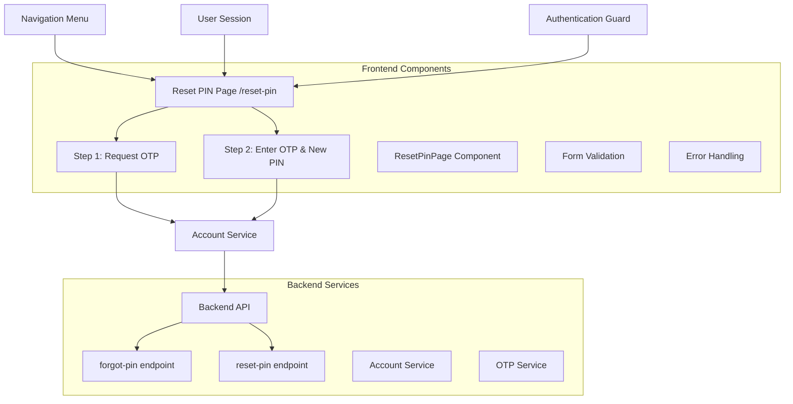

# Design Document: Reset PIN Page Feature

## Overview

The Reset PIN Page feature creates a dedicated, standalone page for PIN reset functionality in the bank simulation application. This addresses the current discoverability issue where the PIN reset feature is hidden within the Accounts page modal. The new implementation will provide a dedicated route `/reset-pin` with its own navigation menu item, making the functionality easily accessible to authenticated users.

The feature leverages the existing backend PIN reset infrastructure (`forgot-pin` and `reset-pin` endpoints) while creating a new frontend page that follows the application's design patterns and user experience standards.

## Architecture

### High-Level Architecture



### Component Architecture

The Reset PIN page follows the established patterns in the application:

1. **Page Component**: `ResetPinPage.tsx` - Main page component with routing integration
2. **Service Integration**: Utilizes existing `accountService.ts` methods
3. **Layout Integration**: Uses `DashboardLayout` for consistent navigation
4. **State Management**: Local React state for form steps and validation
5. **Authentication**: Protected route with session validation

## Components and Interfaces

### Core Components

#### ResetPinPage Component

```typescript
interface ResetPinPageState {
  step: 1 | 2;
  otp: string;
  newPin: string;
  isLoading: boolean;
  error: string | null;
}

interface ResetPinPageProps {
  // No props - standalone page
}
```

**Responsibilities:**
- Manage two-step PIN reset flow
- Handle form validation and submission
- Display appropriate UI for each step
- Integrate with existing account service
- Provide user feedback and error handling

#### Form Components

**Step 1 Component:**
- Display OTP request interface
- Show user email from session
- Handle "Send OTP" action
- Display loading state during API call

**Step 2 Component:**
- OTP input field (6 digits)
- New PIN input field (6 digits)
- Form validation
- Submit button with loading state

### Service Integration

The page will utilize the existing `accountService.ts` methods:

```typescript
// Existing methods to be used
accountService.forgotPin(email: string): Promise<ApiResponse<void>>
accountService.resetPin(email: string, otp: string, newPin: string): Promise<ApiResponse<void>>
```

### Navigation Integration

The navigation menu in `DashboardLayout.tsx` will be extended with a new menu item:

```typescript
{
  path: "/reset-pin",
  icon: KeyRound,
  label: "Reset PIN",
  showAlways: true,
  showForAdmin: true
}
```

## Data Models

### Frontend State Models

```typescript
interface ResetPinFormData {
  otp: string;
  newPin: string;
}

interface ResetPinState {
  currentStep: 1 | 2;
  formData: ResetPinFormData;
  isSubmitting: boolean;
  error: string | null;
  userEmail: string | null;
}
```

### API Integration Models

The page will use existing DTOs from the backend:

**ForgotPinRequest:**
```typescript
interface ForgotPinRequest {
  email: string; // Retrieved from user session
}
```

**ResetPinRequest:**
```typescript
interface ResetPinRequest {
  email: string;    // Retrieved from user session
  otp: string;      // 6-digit OTP from user input
  newPin: string;   // 6-digit PIN from user input
}
```

### Session Data Model

```typescript
interface UserSession {
  userEmail: string;
  token: string;
  isAuthenticated: boolean;
}
```

## Error Handling

### Error Categories

1. **Session Errors**
   - User email not found in session
   - Authentication token missing or invalid
   - Session expired

2. **Validation Errors**
   - Invalid OTP format (not 6 digits)
   - Invalid PIN format (not 6 digits)
   - Empty required fields

3. **API Errors**
   - Network connectivity issues
   - Server errors (5xx)
   - Business logic errors (4xx)
   - Rate limiting errors

4. **User Experience Errors**
   - Page navigation without authentication
   - Browser compatibility issues

### Error Handling Strategy

```typescript
interface ErrorHandler {
  handleSessionError(error: SessionError): void;
  handleValidationError(field: string, message: string): void;
  handleApiError(error: ApiError): void;
  displayUserFriendlyMessage(error: Error): void;
}
```

**Implementation Approach:**
- Use toast notifications for user feedback
- Display inline validation errors for form fields
- Provide retry mechanisms for network errors
- Redirect to login page for authentication errors
- Log errors for debugging while showing user-friendly messages

### Error Recovery

1. **Automatic Recovery:**
   - Retry failed API calls with exponential backoff
   - Clear error states on user input changes
   - Auto-redirect to login on authentication failures

2. **User-Initiated Recovery:**
   - "Try Again" buttons for failed operations
   - Form reset functionality
   - Navigation back to previous steps

## Testing Strategy

### Unit Testing Approach

**Component Testing:**
- Test step transitions and state management
- Validate form input handling and validation
- Mock API calls and test error scenarios
- Test user interaction flows

**Service Integration Testing:**
- Test API call integration with existing accountService
- Validate request/response handling
- Test error propagation and handling

**Validation Testing:**
- Test OTP format validation (exactly 6 digits)
- Test PIN format validation (exactly 6 digits)
- Test required field validation
- Test edge cases (empty strings, special characters)

### Integration Testing

**Route Integration:**
- Test navigation to `/reset-pin` route
- Validate authentication guard functionality
- Test navigation menu integration

**Session Integration:**
- Test user email retrieval from localStorage
- Test authentication token handling
- Test session validation and error handling

**API Integration:**
- Test end-to-end PIN reset flow
- Validate API request formatting
- Test error response handling

### User Experience Testing

**Responsive Design:**
- Test on mobile, tablet, and desktop viewports
- Validate touch interactions on mobile devices
- Test keyboard navigation and accessibility

**Accessibility Testing:**
- Validate ARIA labels and roles
- Test screen reader compatibility
- Test keyboard-only navigation
- Validate color contrast and visual indicators

**Cross-Browser Testing:**
- Test on major browsers (Chrome, Firefox, Safari, Edge)
- Validate JavaScript compatibility
- Test CSS rendering consistency

### Test Implementation Strategy

**Testing Framework:**
- Use existing Vitest setup for unit tests
- Utilize React Testing Library for component testing
- Mock external dependencies (API calls, localStorage)

**Test Coverage Goals:**
- 90%+ code coverage for new components
- 100% coverage for critical paths (PIN reset flow)
- Edge case coverage for validation and error handling

**Test Organization:**
```
src/test/
├── components/
│   └── ResetPinPage.test.tsx
├── services/
│   └── accountService.test.ts (extend existing)
└── integration/
    └── resetPinFlow.test.tsx
```

### Property-Based Testing Assessment

This feature is **NOT suitable** for property-based testing because:

1. **UI Interaction Focus**: The feature is primarily about user interface interactions and form handling
2. **External Dependencies**: Heavy reliance on external API calls and session management
3. **Step-Based Workflow**: The two-step process is more suited to example-based testing with specific scenarios
4. **Configuration-Like Behavior**: The feature is more about configuration and user workflow than algorithmic logic

**Alternative Testing Approach:**
- **Example-based unit tests** for specific user scenarios
- **Integration tests** for API interactions
- **End-to-end tests** for complete user workflows
- **Snapshot tests** for UI consistency

The testing strategy will focus on comprehensive example-based testing to ensure all user paths, error conditions, and edge cases are properly covered.

## Correctness Properties

*A property is a characteristic or behavior that should hold true across all valid executions of a system-essentially, a formal statement about what the system should do. Properties serve as the bridge between human-readable specifications and machine-verifiable correctness guarantees.*

### Property 1: OTP Validation Correctness

*For any* string input to the OTP field, the validation function SHALL accept the input if and only if it consists of exactly 6 digits (0-9) with no other characters.

**Validates: Requirements 3.4**

### Property 2: PIN Validation Correctness  

*For any* string input to the new PIN field, the validation function SHALL accept the input if and only if it consists of exactly 6 digits (0-9) with no other characters.

**Validates: Requirements 3.5**

## Implementation Approach

### Development Strategy

The implementation will follow a phased approach to ensure quality and maintainability:

**Phase 1: Core Page Structure**
1. Create `ResetPinPage.tsx` component with basic layout
2. Implement routing integration in `App.tsx`
3. Add navigation menu item to `DashboardLayout.tsx`
4. Set up basic authentication guards

**Phase 2: Form Implementation**
1. Implement two-step form workflow
2. Add input validation for OTP and PIN fields
3. Integrate with existing `accountService` methods
4. Implement error handling and user feedback

**Phase 3: UI/UX Polish**
1. Add responsive design and mobile optimization
2. Implement accessibility features (ARIA labels, keyboard navigation)
3. Add loading states and animations
4. Ensure design system consistency

**Phase 4: Testing and Quality Assurance**
1. Write comprehensive unit tests
2. Implement integration tests for API calls
3. Add accessibility testing
4. Perform cross-browser testing

### Technical Implementation Details

#### Component Structure

```typescript
// ResetPinPage.tsx
interface ResetPinPageProps {}

interface ResetPinState {
  step: 1 | 2;
  otp: string;
  newPin: string;
  isLoading: boolean;
  error: string | null;
  userEmail: string | null;
}

const ResetPinPage: React.FC<ResetPinPageProps> = () => {
  // Component implementation
};
```

#### Validation Functions

```typescript
// Validation utilities
const validateOtp = (otp: string): boolean => {
  return /^\d{6}$/.test(otp);
};

const validatePin = (pin: string): boolean => {
  return /^\d{6}$/.test(pin);
};

const getValidationError = (field: string, value: string): string | null => {
  if (field === 'otp' && !validateOtp(value)) {
    return 'Invalid OTP format';
  }
  if (field === 'pin' && !validatePin(value)) {
    return 'PIN must be exactly 6 digits';
  }
  return null;
};
```

#### API Integration

```typescript
// Service integration
const handleSendOtp = async () => {
  const userEmail = localStorage.getItem('userEmail');
  if (!userEmail) {
    setError('User email not found in session');
    return;
  }
  
  setIsLoading(true);
  try {
    await accountService.forgotPin(userEmail);
    toast.success('OTP sent to your email!');
    setStep(2);
  } catch (error: any) {
    setError(error.message || 'Failed to send OTP');
  } finally {
    setIsLoading(false);
  }
};

const handleResetPin = async () => {
  const userEmail = localStorage.getItem('userEmail');
  if (!userEmail || !otp || !newPin) {
    setError('Please fill in all fields');
    return;
  }
  
  setIsLoading(true);
  try {
    await accountService.resetPin(userEmail, otp, newPin);
    toast.success('Account PIN reset successfully!');
    navigate('/accounts');
  } catch (error: any) {
    setError(error.message || 'Failed to reset PIN');
  } finally {
    setIsLoading(false);
  }
};
```

#### Routing Configuration

```typescript
// App.tsx - Add new route
<Route
  path="/reset-pin"
  element={
    <ProtectedRoute>
      <ResetPinPage />
    </ProtectedRoute>
  }
/>
```

#### Navigation Integration

```typescript
// DashboardLayout.tsx - Add menu item
{
  path: "/reset-pin",
  icon: KeyRound,
  label: "Reset PIN",
  showAlways: true,
  showForAdmin: true
}
```

### UI Component Design

#### Step 1: Request OTP

```typescript
const Step1Component = ({ onSendOtp, isLoading, userEmail, error }) => (
  <Card className="w-full max-w-md mx-auto">
    <CardHeader>
      <CardTitle className="flex items-center gap-2">
        <KeyRound className="h-5 w-5" />
        Reset PIN - Step 1
      </CardTitle>
      <CardDescription>
        We'll send an OTP to your registered email address
      </CardDescription>
    </CardHeader>
    <CardContent className="space-y-4">
      <div className="space-y-2">
        <Label>Email Address</Label>
        <Input value={userEmail || ''} disabled />
      </div>
      {error && (
        <Alert variant="destructive">
          <AlertDescription>{error}</AlertDescription>
        </Alert>
      )}
      <Button 
        onClick={onSendOtp} 
        disabled={isLoading || !userEmail}
        className="w-full"
      >
        {isLoading ? (
          <Loader2 className="h-4 w-4 animate-spin mr-2" />
        ) : (
          <KeyRound className="h-4 w-4 mr-2" />
        )}
        {isLoading ? 'Sending...' : 'Send OTP'}
      </Button>
    </CardContent>
  </Card>
);
```

#### Step 2: Enter OTP and New PIN

```typescript
const Step2Component = ({ 
  otp, 
  newPin, 
  onOtpChange, 
  onPinChange, 
  onSubmit, 
  onBack,
  isLoading, 
  error 
}) => (
  <Card className="w-full max-w-md mx-auto">
    <CardHeader>
      <CardTitle className="flex items-center gap-2">
        <KeyRound className="h-5 w-5" />
        Reset PIN - Step 2
      </CardTitle>
      <CardDescription>
        Enter the OTP sent to your email and your new 6-digit PIN
      </CardDescription>
    </CardHeader>
    <CardContent className="space-y-4">
      <div className="space-y-2">
        <Label htmlFor="otp">OTP (6 digits)</Label>
        <Input
          id="otp"
          type="text"
          maxLength={6}
          value={otp}
          onChange={(e) => onOtpChange(e.target.value.replace(/\D/g, ''))}
          placeholder="123456"
          aria-describedby="otp-error"
        />
      </div>
      <div className="space-y-2">
        <Label htmlFor="newPin">New PIN (6 digits)</Label>
        <Input
          id="newPin"
          type="password"
          maxLength={6}
          value={newPin}
          onChange={(e) => onPinChange(e.target.value.replace(/\D/g, ''))}
          placeholder="••••••"
          aria-describedby="pin-error"
        />
      </div>
      {error && (
        <Alert variant="destructive">
          <AlertDescription>{error}</AlertDescription>
        </Alert>
      )}
      <div className="flex gap-2">
        <Button variant="outline" onClick={onBack} className="flex-1">
          Back
        </Button>
        <Button 
          onClick={onSubmit} 
          disabled={isLoading || !otp || !newPin}
          className="flex-1"
        >
          {isLoading ? (
            <Loader2 className="h-4 w-4 animate-spin mr-2" />
          ) : null}
          {isLoading ? 'Processing...' : 'Reset PIN'}
        </Button>
      </div>
    </CardContent>
  </Card>
);
```

### Accessibility Implementation

#### ARIA Labels and Roles

```typescript
// Accessibility attributes
<div role="main" aria-labelledby="reset-pin-title">
  <h1 id="reset-pin-title" className="sr-only">Reset PIN Page</h1>
  
  <Input
    aria-label="One-time password"
    aria-describedby="otp-help otp-error"
    aria-required="true"
    aria-invalid={otpError ? 'true' : 'false'}
  />
  
  <div id="otp-help" className="text-sm text-muted-foreground">
    Enter the 6-digit code sent to your email
  </div>
  
  {otpError && (
    <div id="otp-error" role="alert" className="text-sm text-destructive">
      {otpError}
    </div>
  )}
</div>
```

#### Keyboard Navigation

```typescript
// Focus management
useEffect(() => {
  if (step === 2) {
    // Focus OTP input when step 2 loads
    const otpInput = document.getElementById('otp');
    otpInput?.focus();
  }
}, [step]);

// Handle Enter key submission
const handleKeyPress = (e: KeyboardEvent) => {
  if (e.key === 'Enter') {
    if (step === 1) {
      handleSendOtp();
    } else if (step === 2 && otp && newPin) {
      handleResetPin();
    }
  }
};
```

### Performance Considerations

#### Code Splitting

```typescript
// Lazy load the component
const ResetPinPage = lazy(() => import('./pages/ResetPinPage'));

// In App.tsx
<Route
  path="/reset-pin"
  element={
    <ProtectedRoute>
      <Suspense fallback={<div>Loading...</div>}>
        <ResetPinPage />
      </Suspense>
    </ProtectedRoute>
  }
/>
```

#### Memoization

```typescript
// Memoize validation functions
const validateOtp = useMemo(() => (otp: string) => {
  return /^\d{6}$/.test(otp);
}, []);

const validatePin = useMemo(() => (pin: string) => {
  return /^\d{6}$/.test(pin);
}, []);
```

### Security Considerations

#### Input Sanitization

```typescript
// Sanitize inputs to prevent XSS
const sanitizeInput = (input: string): string => {
  return input.replace(/[^\d]/g, '').slice(0, 6);
};

const handleOtpChange = (value: string) => {
  setOtp(sanitizeInput(value));
};

const handlePinChange = (value: string) => {
  setNewPin(sanitizeInput(value));
};
```

#### Session Validation

```typescript
// Validate session before API calls
const validateSession = (): boolean => {
  const token = localStorage.getItem('token');
  const userEmail = localStorage.getItem('userEmail');
  
  if (!token || !userEmail) {
    navigate('/login');
    return false;
  }
  
  return true;
};
```

### Error Recovery Mechanisms

#### Retry Logic

```typescript
// Implement retry for failed API calls
const retryApiCall = async (apiCall: () => Promise<any>, maxRetries = 3) => {
  for (let attempt = 1; attempt <= maxRetries; attempt++) {
    try {
      return await apiCall();
    } catch (error) {
      if (attempt === maxRetries) throw error;
      await new Promise(resolve => setTimeout(resolve, 1000 * attempt));
    }
  }
};
```

#### Graceful Degradation

```typescript
// Handle network errors gracefully
const handleNetworkError = (error: any) => {
  if (!navigator.onLine) {
    setError('No internet connection. Please check your network and try again.');
  } else if (error.code === 'NETWORK_ERROR') {
    setError('Network error. Please try again in a moment.');
  } else {
    setError('An unexpected error occurred. Please try again.');
  }
};
```

This comprehensive design document provides a complete technical blueprint for implementing the Reset PIN Page feature, ensuring it integrates seamlessly with the existing application architecture while providing a superior user experience compared to the current modal-based implementation.